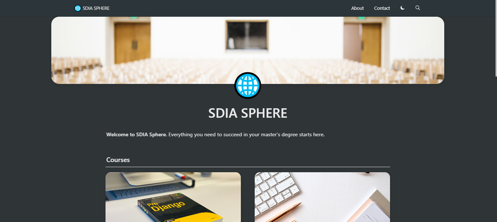

  

# SDIA SPHERE

> Welcome to SDIA Sphere. Everything you need to succeed in your master's degree starts here. (SDIA Master Degree)

## Intro

This project uses Notion as a CMS, [react-notion-x](https://github.com/NotionX/react-notion-x), [Next.js](https://nextjs.org/), and [Vercel](https://vercel.com).

## Features

- Based on [nextjs-notion-starter-kit](https://github.com/transitive-bullshit/nextjs-notion-starter-kit)
- Built using Next.js, TS, and React
- Automatic pretty URLs
- Automatic table of contents
- Full support for dark mode

## Live

- [My site](https://sdia-sphere.vercel.app/) - Deployed from the `sdia` branch

## Setup

**All config is defined in [site.config.ts](./site.config.ts).**

This project requires a recent version of Node.js (we recommend >= 16).

1. Fork / clone this repo
2. Change a few values in [site.config.ts](./site.config.ts)
3. `npm install`
4. `npm run dev` to test locally

